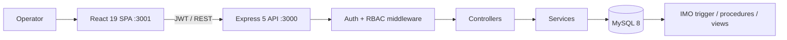
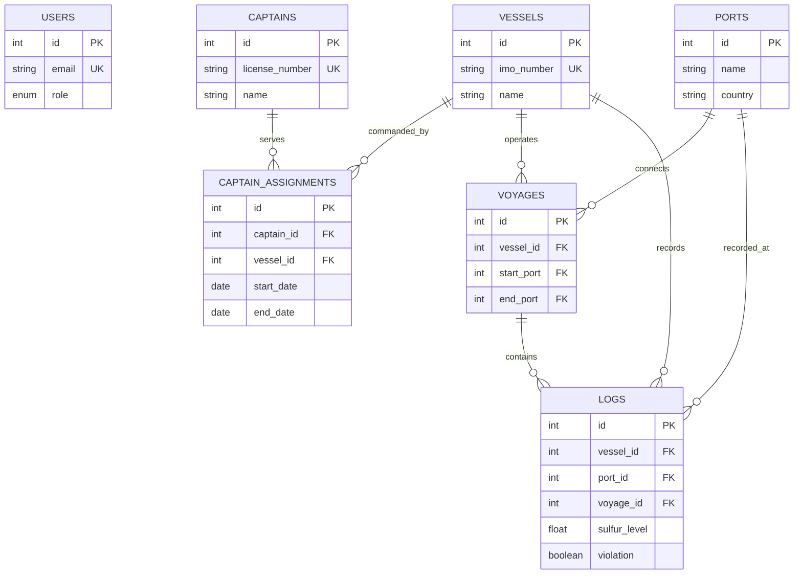

# Maritime Dominion

### A Maritime Compliance & Fleet Intelligence System

---

## Overview

**Maritime Dominion** is a full-stack database-driven application designed to manage maritime fleet operations, monitor environmental compliance, and analyze vessel activity.

The system integrates a **relational database (MySQL)** with an **Express.js backend** and a **React frontend**, emphasizing strong **DBMS concepts** such as normalization, constraints, triggers, and PL/SQL constructs.

---

##  Key Features

### Fleet Management

* Register and manage vessels with unique IMO numbers
* Track vessel metadata (flag state, type, etc.)

### Captain & Assignment Tracking

* Maintain captain records
* Track captain assignments over time
* Automatically manage active/inactive command periods

###  Compliance Logging

* Record sulfur levels and waste discharge
* Automatic violation detection using database triggers
* Historical log tracking with timestamps

###  Violation Monitoring

* Identify environmental violations (IMO 2020 compliance)
* Dashboard view for quick inspection

### Vessel Passport System

* Consolidated view of:

  * Vessel details
  * Captain history
  * Recent compliance logs
* Decision system for port entry approval

###  Authentication System

* Secure login/signup using JWT
* Role-based access (admin/officer/viewer)

---

##  DBMS Concepts Implemented

###  Database Design

* Entity–Relationship modeling
* Relational schema with primary & foreign keys

###  Normalization

* Tables normalized up to **3NF**
* Eliminates redundancy and ensures consistency

### Constraints

* NOT NULL, UNIQUE, FOREIGN KEY
* Enforces data integrity

### Trigger

* `check_violation` trigger automatically flags violations

###  Stored Procedure

* Encapsulates business logic for vessel registration

###  Function

* Computes analytical metrics (e.g., vessel risk score)

### Cursor

* Iterative processing for compliance audit reporting

### Views

* `vessel_compliance_dashboard` for aggregated insights

### Transactions

* Demonstrates ACID properties using COMMIT/ROLLBACK

---

## Tech Stack

| Layer    | Technology            |
| -------- | --------------------- |
| Database | MySQL                 |
| Backend  | Node.js + Express     |
| Frontend | React                 |
| Auth     | JWT (JSON Web Tokens) |
| Styling  | Custom CSS            |

---

## Project Structure

```
maritime-dominion/
│
├── db.sql                 # Database schema + advanced DBMS layer
├── backend/
│   └── server.js          # Express API server
├── maritime-frontend/
│   ├── src/
│   └── public/
└── package.json
```

---

## Setup Instructions

### 1️ Database Setup

```bash
# Open MySQL and run:
source db.sql;
```

---

### 2️ Backend Setup

```bash
cd backend
npm install
node server.js
```

Server runs at:
 `http://localhost:3001`

---

### 3️ Frontend Setup

```bash
cd maritime-frontend
npm install
npm start
```

Frontend runs at:
 `http://localhost:3000` (React dev server)

---

##  API Highlights

| Endpoint               | Description         |
| ---------------------- | ------------------- |
| `/auth/signup`         | Register new user   |
| `/auth/login`          | Login user          |
| `/vessels`             | Get all vessels     |
| `/add-vessel`          | Add vessel          |
| `/logs`                | Get logs            |
| `/add-log`             | Add compliance log  |
| `/captains`            | Get captains        |
| `/assign-captain`      | Assign captain      |
| `/vessel-passport/:id` | Full vessel profile |

---

##  Sample Use Cases

* Monitor sulfur compliance across fleet
* Identify high-risk vessels using analytical functions
* Track captain assignments historically
* Generate compliance dashboards

---

## Highlights

* Strong **backend-first DBMS design**
* Real-world **maritime compliance system**
* Advanced SQL + PL/SQL integration
* Clean and modern UI
* Scalable architecture

---

##  Future Improvements

* Role-based admin dashboard
* Real-time alerts for violations
* Data visualization (charts)
* Deployment (Docker / Cloud)

---

##  Author

**Jatin**
B.Tech Computer Engineering
Thapar University

---

##  License

This project is for academic purposes.

---

##  Final Note

This project demonstrates how **database systems are not just storage tools**, but powerful engines for enforcing rules, ensuring integrity, and enabling intelligent decision-making.

---

# Maritime Dominion

**A secure fleet-operations and environmental-compliance platform.** Operators can manage vessels and command assignments, record sulfur and waste logs, inspect a vessel passport, prioritize risk, and export audit-ready reports.

## Highlights

- Enforces the IMO 2020 **0.5% sulfur cap** in MySQL via a trigger—compliance rules hold even if another client bypasses the API.
- Computes a **0–100 risk score** from violations and maximum sulfur exceedance, turning raw logs into a ranked operational queue.
- Implements **JWT authentication, bcrypt hashing, parameterized queries, role-based access control**, and transaction-safe captain reassignment.
- Exports fleet-level CSV reports for audit handoff and supports a normalized schema with stored procedures, views, functions, and foreign keys.

## Screens

The application includes a cinematic landing experience, authenticated fleet dashboard, vessel passport, compliance logs, and a risk radar. Run the one-command setup below to explore them locally; screenshots and a short demo capture should be placed in `docs/media/` before publishing a portfolio repository.

## Architecture



## Data model



## Roles

| Role | Read fleet data | Add compliance logs | Manage vessels, captains, assignments |
| --- | --- | --- | --- |
| `viewer` | Yes | No | No |
| `officer` | Yes | Yes | No |
| `admin` | Yes | Yes | Yes |

New sign-ups receive the `officer` role. Set `BOOTSTRAP_ADMIN_EMAIL` in `backend/.env` to the email of the first administrator **before that user signs up**. That account can then use the dashboard's **Access control** page to change other members' roles. This endpoint is restricted to administrators; members cannot elevate their own access. If an existing local installation has no administrator, use the one-time recovery command: `UPDATE users SET role = 'admin' WHERE email = 'you@example.com';`, then sign out and back in.

## One-command setup

```bash
docker compose up --build
```

This provisions MySQL, imports `db.sql`, starts the API at `http://localhost:3000`, and serves the client at `http://localhost:3001`. The health endpoint is `GET /health`.

For local development, copy `backend/.env.example` to `backend/.env` and `maritime-frontend/.env.example` to `maritime-frontend/.env`, run `node server.js` from `backend`, and run `npm start` from `maritime-frontend`. Configure `REACT_APP_API_URL` when the client targets a different API origin.

## API surface

All protected resources are versioned under `/api/v1`.

| Method | Endpoint | Minimum role |
| --- | --- | --- |
| POST | `/auth/signup`, `/auth/login` | Public |
| GET | `/users` | Admin |
| PATCH | `/users/:id/role` | Admin |
| GET / POST | `/vessels` | Viewer / Admin |
| GET | `/vessels/:id/passport` | Viewer |
| GET / POST | `/logs` | Viewer / Officer |
| GET / POST | `/captains` | Viewer / Admin |
| POST | `/assignments` | Admin |

## Resume-ready description

Built **Maritime Dominion**, a Dockerized React–Express–MySQL fleet compliance platform. Designed a normalized maritime data model and database-enforced IMO sulfur validation; added JWT/RBAC-protected REST APIs, transaction-safe captain assignment, risk scoring, and CSV audit reporting to translate environmental logs into prioritized operational decisions.
